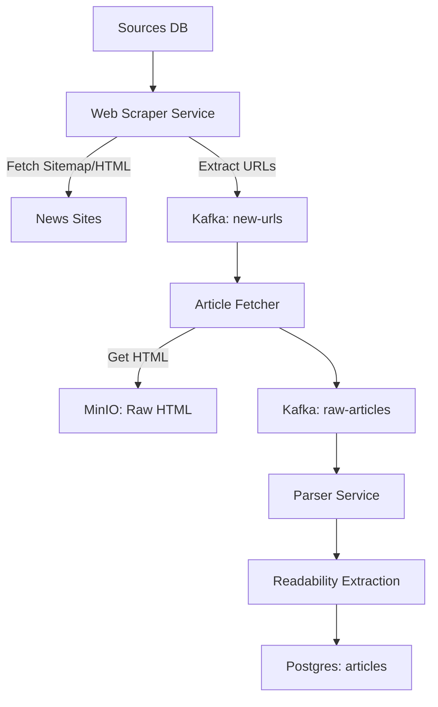

# Web Ingestion Pipeline Specification

## 1. Overview
This module adds capability to ingest news articles by crawling web pages (sitemaps and section pages) for sources that do not provide RSS feeds or have incomplete feeds. It operates alongside the existing RSS `feed-collector`.

## 2. Architecture



## 3. Database Schema Updates

### 3.1. Sources Table
We will leverage the existing `scrape_rules` JSONB column in `sources` or create a more structured `discovery_rules` table?
User suggested: `sitemap_url`, `sections` array, `crawl_interval`.

Existing `sources` table:
```sql
CREATE TABLE sources (
    ...
    scrape_rules JSONB -- Existing
);
```

Proposed Schema Extension (Migration):
```sql
-- New table to manage discovery endpoints (Sitemaps, Section Pages)
-- This replaces/extends the 'feeds' table concept.
-- 'feeds' table currently has 'type' ('rss', 'atom'). We can add 'sitemap', 'web_section'.

ALTER TABLE feeds ADD COLUMN config JSONB; 
-- config can hold: { "section_selector": "div.news-list a", "filters": ["/news/", "/2025/"] }
```

Actually, sticking to `feeds` table is cleaner.
- `url`: The endpoint (RSS URL, Sitemap XML URL, or Section Page URL).
- `type`: `rss`, `atom`, `sitemap`, `html_section`.
- `config` (NEW): JSONB for selectors (if `html_section`) or patterns (if `sitemap`).

### 3.2. Scraper Configuration (JSONB)
Structure for `config`:
```json
{
  "selector": "article h2 a",  // CSS selector for links in HTML
  "url_pattern": "/news/\\d{4}/", // Regex for valid article URLs
  "deny_pattern": "/video/",
  "max_depth": 1
}
```

## 4. Services

### 4.1. Web Scraper Service (New)
*   **Role**: Discovers new Article URLs. equivalent to `feed-collector`.
*   **Language**: Go (for concurrency) or Node (for simple DOM handling). Let's stick to Node.js for easy Cheerio integration, or Go with Colly/GoQuery. Existing `feed-collector` is Go `gofeed`. Go is good.
*   **Responsibilities**:
    1.  Poll `feeds` where `type IN ('sitemap', 'html_section')`.
    2.  **Sitemap Mode**: Parse XML, extract `<loc>`, filter by pattern.
    3.  **HTML Mode**: Fetch HTML, use CSS selectors to find links.
    4.  **Dedup**: Check Redis Bloom Filter (existing).
    5.  **Publish**: Send unique URLs to `new-urls` topic.

### 4.2. Article Fetcher (Existing)
*   Already handles fetching HTML from `new-urls`.
*   **Update**: Ensure it respects `robots.txt` more strictly for generic web scraping. (User requirement).

### 4.3. Parser (Existing)
*   Already parses HTML.
*   **Update**: Ensure "Readability" logic is robust enough for generic pages (currently might be tuned for specific structures?). `Mozilla Readability` is usually good enough.

## 5. Implementation Steps
1.  **DB Migration**: Add `config` to `feeds`. Add `html_section` and `sitemap` to `type` check.
2.  **Web Scraper Service**:
    *   Initialize Go project `services/web-scraper`.
    *   Implement Worker to poll DB.
    *   Implement Sitemap Parser.
    *   Implement HTML Scraper (Colly or GoQuery).
    *   Implement Kafka Producer.
3.  **Integration**:
    *   Add `web-scraper` to `docker-compose.yml`.
    *   Test with a "Web Only" source (e.g. `example.com/news`).
